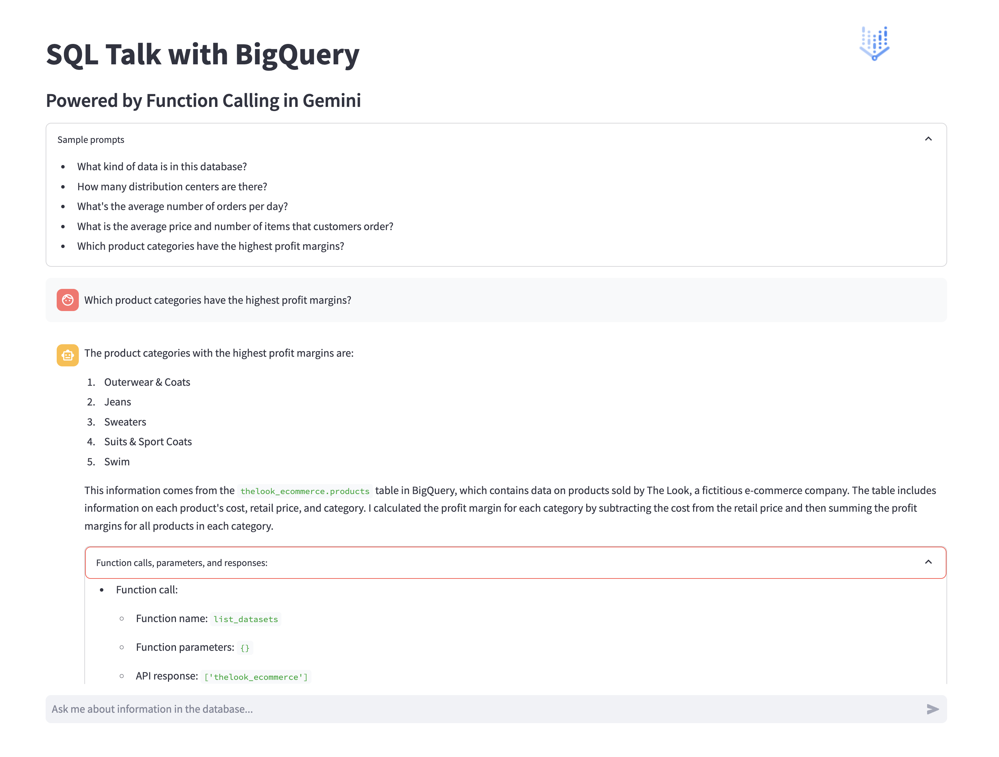

# SQL Talk: Natural Language to BigQuery with Gemini's Function Calling

## Overview

This app demonstrates the power of
[Gemini's Function Calling](https://cloud.google.com/vertex-ai/docs/generative-ai/multimodal/function-calling)
capabilities, enabling users to query and understand their
[BigQuery](https://cloud.google.com/bigquery) databases using natural language.
Forget complex SQL syntax – interact with your data conversationally.

Function Calling in Gemini lets developers create a description of a function in
their code, then pass that description to a language model in a request. The
response from the model includes the name of a function that matches the
description and the arguments to call it with.



## Prerequisites

- A Google Cloud project with billing enabled
- A BigQuery dataset (we used the
  [`thelook_ecommerce` public dataset](https://console.cloud.google.com/marketplace/product/bigquery-public-data/thelook-ecommerce))
- APIs for Vertex AI, BigQuery, and Cloud Run enabled
- Familiarity with Python and SQL concepts

## Run and modify the app in Cloud Shell Editor

After you've tried out the live demo app, you can also run your own version of
the SQL Talk app and make changes to the live app using the Cloud Shell Editor
in your own Google Cloud project.

[Open this repository and the sample app in the Cloud Shell
Editor](https://shell.cloud.google.com/cloudshell/editor?cloudshell_git_repo=https://github.com/GoogleCloudPlatform/generative-ai.git&cloudshell_workspace=gemini/function-calling/sql-talk-app/&cloudshell_tutorial=tutorial.md&cloudshell_open_in_editor=app.py),
then follow the steps displayed in the tutorial in the sidebar.

## Additional resources

You can learn more about Function Calling in Gemini with these guides and
resources:

- [Documentation on Function Calling in Gemini](https://cloud.google.com/vertex-ai/docs/generative-ai/multimodal/function-calling)
- [Codelab on How to Interact with APIs Using Function Calling in Gemini](https://codelabs.developers.google.com/codelabs/gemini-function-calling)
- [Sample notebook for Function Calling with the Gemini API](https://github.com/GoogleCloudPlatform/generative-ai/blob/main/gemini/function-calling/intro_function_calling.ipynb)

## (Optional) Deploy the app to Cloud Run

When deploying this app to Cloud Run, a best practice is to [create a service
account](https://cloud.google.com/iam/docs/service-accounts-create) to attach
the following roles to, which are the permissions required for the app to read
data from BigQuery, run BigQuery jobs, and use resources in Vertex AI:

- [BigQuery Data Viewer](https://cloud.google.com/bigquery/docs/access-control#bigquery.dataViewer) (`roles/bigquery.dataViewer`)
- [BigQuery Job User](https://cloud.google.com/bigquery/docs/access-control#bigquery.jobUser) (`roles/bigquery.jobUser`)
- [Vertex AI User](https://cloud.google.com/vertex-ai/docs/general/access-control#aiplatform.user) (`roles/aiplatform.user`)

To deploy this app to
[Cloud Run](https://cloud.google.com/run/docs/deploying-source-code), run the
following command to have the app built with Cloud Build and deployed to Cloud
Run, replacing the `service-account` and `project` values with your own values,
similar to:

```shell
gcloud run deploy sql-talk --allow-unauthenticated --region us-central1 --service-account SERVICE_ACCOUNT_NAME@PROJECT_ID.iam.gserviceaccount.com --source .
```


Congratulations, you've successfully deployed the SQL Talk demo app!
